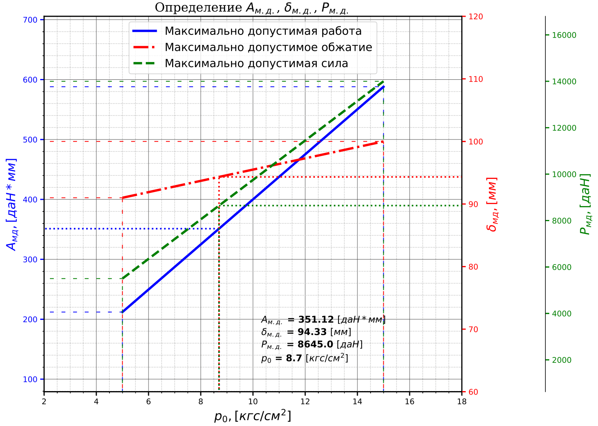

# Chassis-Lab

### Лабораторная работа по "Шасси"

Подбор пневматика и построение кинематической схемы

#

#### Особенности реализации:
- подходит для вариантов АА, АВ (телескопическая стойка);

##### Реализованные этапы
- Подбор пневматика в зависимости от выбранного варианта;
- Построение графика для определения некоторых параметров.

### Пример графика:

